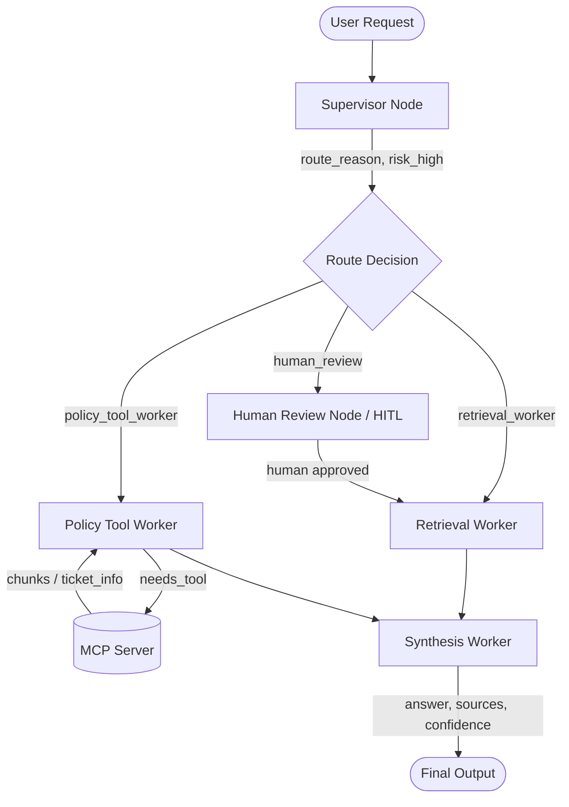

# System Architecture — Lab Day 09

**Nhóm:** 9

**Ngày:** 14/04/2026

**Version:** 1.0

---

## 1. Tổng quan kiến trúc

Hệ thống được thiết kế theo mô hình **Supervisor-Worker** (sử dụng LangGraph) để giải quyết bài toán trợ lý nội bộ CS & IT Helpdesk. Mô hình này phân tách rõ ràng trách nhiệm giữa việc ra quyết định điều hướng và việc thực thi các tác vụ chuyên môn sâu.

**Pattern đã chọn:** Supervisor-Worker  
**Lý do chọn pattern này (thay vì single agent):**
- **Phân tách trách nhiệm (Separation of Concerns):** Agent điều phối (Supervisor) chỉ tập trung hiểu ý định người dùng và phân loại rủi ro, trong khi các Workers tập trung vào chuyên môn (tìm kiếm, kiểm tra chính sách).
- **Dễ dàng theo dõi và debug (Traceability):** Khi có lỗi, có thể dễ dàng kiểm tra xem lỗi do phân luồng sai hay do worker thực hiện sai dựa vào state history.
- **Khả năng mở rộng (Extensibility):** Dễ dàng thêm các worker mới hoặc tích hợp với các công cụ bên ngoài thông qua MCP Server mà không làm phình to prompt của một agent duy nhất.
- **Kiểm soát rủi ro:** Có thể dễ dàng chèn bước Human-in-the-loop (HITL) vào pipeline thông qua đánh giá risk_high của Supervisor.

---

## 2. Sơ đồ Pipeline

**Sơ đồ thực tế của nhóm:**

---

## 3. Vai trò từng thành phần

### Supervisor (`graph.py`)

| Thuộc tính | Mô tả |
|-----------|-------|
| **Nhiệm vụ** | Phân tích câu hỏi đầu vào, đánh giá rủi ro (risk_high), xác định có cần dùng tool ngoài không (needs_tool) và quyết định luồng đi (route). |
| **Input** | `task` (câu hỏi từ user) |
| **Output** | `supervisor_route`, `route_reason`, `risk_high`, `needs_tool` |
| **Routing logic** | Sử dụng LLM (gpt-4o-mini) với Structured Output để phân loại dựa vào từ khóa (refund, access -> policy; P1, SLA -> retrieval) và tính chất yêu cầu. |
| **HITL condition** | Kích hoạt (`route="human_review"`) khi gặp mã lỗi không xác định (ERR-xxx) đi kèm rủi ro cao hoặc các yêu cầu khẩn cấp/nhạy cảm (2am, emergency). |

### Retrieval Worker (`workers/retrieval.py`)

| Thuộc tính | Mô tả |
|-----------|-------|
| **Nhiệm vụ** | Tìm kiếm và trích xuất các đoạn tài liệu (chunks) liên quan từ Knowledge Base (ChromaDB). |
| **Embedding model** | `text-embedding-3-small` (OpenAI)|
| **Top-k** | Default = 3 chunks |
| **Stateless?** | Yes. Không lưu giữ trạng thái, đầu vào độc lập sinh ra đầu ra độc lập. |

### Policy Tool Worker (`workers/policy_tool.py`)

| Thuộc tính | Mô tả |
|-----------|-------|
| **Nhiệm vụ** | Phân tích chính sách dựa trên context, xác định hành động có được phép hay không, gọi MCP tools khi cần thiết để lấy thêm thông tin. |
| **MCP tools gọi** | `search_kb`, `get_ticket_info` qua HTTP Server (FastAPI). |
| **Exception cases xử lý** | Ngoại lệ hoàn tiền (Flash Sale, Digital Product, sản phẩm đã kích hoạt), phân biệt policy theo phiên bản. |

### Synthesis Worker (`workers/synthesis.py`)

| Thuộc tính | Mô tả |
|-----------|-------|
| **LLM model** | `gpt-4o-mini` |
| **Temperature** | 0.1 (để đảm bảo tính grounded, tránh hallucination) |
| **Grounding strategy** | CHỈ trả lời dựa vào context được cung cấp, yêu cầu trích dẫn nguồn cuối mỗi câu `[tên_file]`. |
| **Abstain condition** | Nếu context không đủ, phải trả lời nguyên văn: "Không đủ thông tin trong tài liệu nội bộ". |

### MCP Server (`mcp_server.py`)

| Tool | Input | Output |
|------|-------|--------|
| search_kb | query, top_k | chunks, sources, total_found |
| get_ticket_info | ticket_id | ticket details (priority, status, assignee...) |
| check_access_permission | access_level, requester_role, is_emergency | can_grant, required_approvers, emergency_override, notes |
| create_ticket | priority, title, description | ticket_id, url, created_at |

---

## 4. Shared State Schema

| Field | Type | Mô tả | Ai đọc/ghi |
|-------|------|-------|-----------|
| task | str | Câu hỏi đầu vào | supervisor đọc |
| supervisor_route | str | Worker được chọn để xử lý tiếp theo | supervisor ghi, graph đọc |
| route_reason | str | Lý do route chi tiết | supervisor ghi |
| risk_high | bool | Cờ báo hiệu rủi ro cao cần chú ý/HITL | supervisor ghi |
| needs_tool | bool | Cờ báo hiệu cần dùng tool MCP | supervisor ghi, policy_tool đọc |
| hitl_triggered | bool | Cờ báo hiệu đã kích hoạt Human-in-the-loop | human_review ghi |
| retrieved_chunks | list | Evidence (các đoạn text) từ retrieval/MCP | retrieval/policy_tool ghi, synthesis đọc |
| retrieved_sources | list | Danh sách nguồn tài liệu đã lấy được | retrieval/policy_tool ghi |
| policy_result | dict | Kết quả kiểm tra policy (applies, exceptions) | policy_tool ghi, synthesis đọc |
| mcp_tools_used | list | Log các Tool calls đã thực hiện | policy_tool ghi |
| final_answer | str | Câu trả lời cuối cùng tổng hợp được | synthesis ghi |
| confidence | float | Mức tin cậy của câu trả lời (0.0 - 1.0) | synthesis ghi |
| history | list | Lịch sử các bước chạy trong pipeline | Tất cả workers/nodes ghi |
| workers_called | list | Danh sách tên các worker đã được thực thi | Tất cả workers/nodes ghi |
| latency_ms | int | Thời gian xử lý tổng cộng | graph ghi |

---

## 5. Lý do chọn Supervisor-Worker so với Single Agent (Day 08)

| Tiêu chí | Single Agent (Day 08) | Supervisor-Worker (Day 09) |
|----------|----------------------|--------------------------|
| Debug khi sai | Khó — không rõ lỗi ở khâu retrieval, policy hay generation | Dễ hơn — test từng worker độc lập, trace log rõ ràng |
| Thêm capability mới | Phải sửa toàn prompt, dễ làm LLM bị nhầm lẫn context | Thêm worker/MCP tool riêng, giữ prompt của từng worker đơn giản |
| Routing visibility | Không có (một cục monolithic) | Có route_reason chi tiết trong trace |
| Tính ổn định | Dễ bị hallucination khi xử lý logic phức tạp | LLM chuyên biệt hóa theo task (phân loại, phân tích, tổng hợp) nên grounded hơn |

**Nhóm điền thêm quan sát từ thực tế lab:**
Khi sử dụng Multi-Agent, việc thiết lập strict guidelines trong `synthesis.py` (chỉ dùng nội dung có sẵn, yêu cầu trích dẫn cụ thể) đạt hiệu quả cao hơn hẳn so với Single Agent, bởi vì lượng thông tin truyền vào prompt tổng hợp đã được tinh lọc và xử lý trước bởi các worker khác. Điển hình là khi gặp lỗi không có thông tin, hệ thống abstain rất chuẩn xác thay vì cố bịa ra cấu hình.

---

## 6. Giới hạn và điểm cần cải tiến

1. **Độ trễ (Latency) cao:** Do phải đi qua nhiều node (Supervisor -> Worker -> Synthesis), mỗi node là một lần gọi LLM hoặc Tool, nên latency cao hơn Single Agent (hiện tại trung bình khoảng ~5-7s).
2. **Luồng đồ thị (Graph Flow) bị tĩnh:** Trong trường hợp `human_review` hiện tại chỉ được hardcode luồng đi tiếp sang `retrieval_worker`. Nếu câu hỏi thuộc về policy, nó sẽ bỏ lỡ nhịp kiểm tra policy. Sẽ cần nâng cấp thành routing động sau bước HITL.
3. **Single path routing:** Hiện tại Supervisor chỉ chọn 1 worker. Đối với các câu hỏi phức tạp (cross-document, multi-hop) như "cần cấp quyền Level 2 và notify SLA", việc chạy tuần tự một luồng có thể bị thiếu context. Cần cải tiến graph hỗ trợ Multi-Agent thực thụ (ví dụ: Supervisor lên Plan -> chạy song song cả Policy Worker và Retrieval Worker -> Synthesis).
